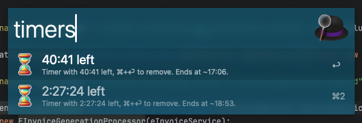

# Quick Timer & Alarm - An Alfred 5 for MacOS workflow
A simple but effective timer and alarm workflow for Alfred 5 for MacOS. This workflow allows you to quickly set timers and alarms using Alfred. Simply type the command followed by a time duration, and the workflow will notify you when the time is up.

## Installation
Download the latest release here on Github and double click on the `.alfredworkflow` file.

The workflow should be automatically configured and imported ready for use.

## **How to Use**  

### **1. Set Timers**  
Use the keyword `timer` followed by a duration to start a countdown.  

💡 **Examples:**  
- `timer 10s` → Starts a 10-second countdown timer  
- `timer 5m` → Starts a 5-minute countdown timer  
- `timer 1h 30m` → Starts a 1-hour and 30-minute countdown timer  

Once the timer expires, Alfred will notify you with a message:  
✅ **"1h 30m timer is done!"**  

### **2. Set Alarms**  
Use the keyword `alarm` followed by a target time duration.  

💡 **Examples:**  
- `alarm 14h 30m` → Sets an alarm that will fire at 2:30 PM
- `alarm 8h` → Sets an alarm that will fire at 8:00 AM  

Once the alarm time is reached, Alfred will notify you.

### **3. List Active Timers**  
Use the `timers` command to view active timers along with their approximate ending times.  

💡 **Example Output:**  

Timers:
- ⏳ 44:17 left (Timer with 44:17 left. Ends at ~14:12)
- ⏳ 3:44:17 left (Timer with 3:44:17 left. Ends at ~17:12)

### **Notes**
- If Alfred 5 is restarted, timers will persist.  
- You can stack multiple time units for timers (e.g., `1h 15m 30s`). 

Never miss a meeting again! 🚀
